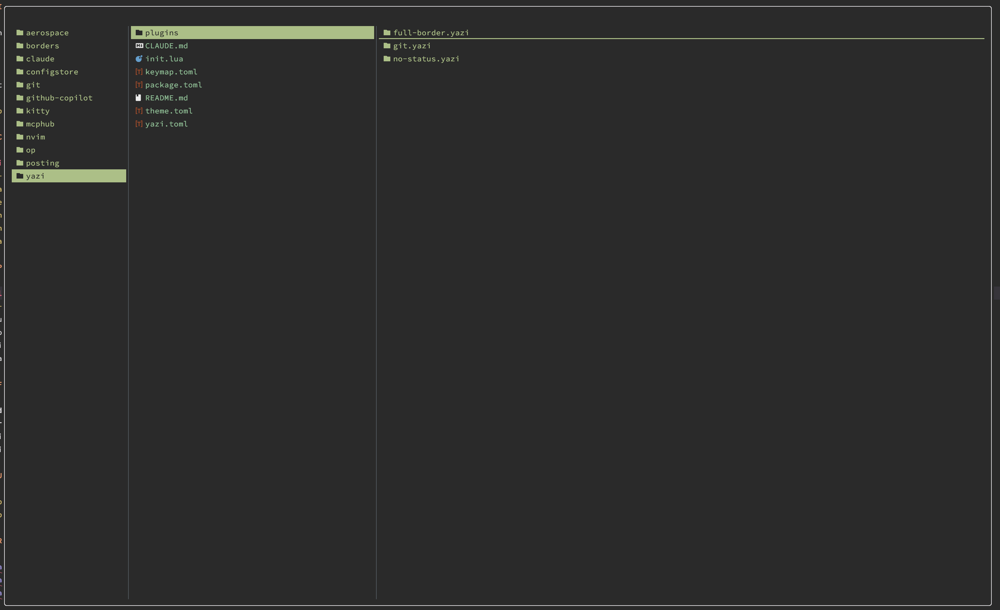

# yazi-clean-config

Yazi configuration for macOS with Neovim integration and clean minimal interface.



## Prerequisites

Install Yazi and optional dependencies via Homebrew:

```bash
brew update
brew install yazi ffmpeg sevenzip jq poppler fd ripgrep fzf zoxide resvg imagemagick font-symbols-only-nerd-font
```

## Installation

Clone this repository to your Yazi config directory:

```bash
git clone https://github.com/Narong-Kanthanu/yazi-clean-config.git ~/.config/yazi
```

Install plugins:

```bash
ya pkg install
```

## Configuration Structure

| File           | Description                                         |
| -------------- | --------------------------------------------------- |
| `yazi.toml`    | Main configuration (manager, preview, file openers) |
| `keymap.toml`  | Custom keybindings                                  |
| `theme.toml`   | Custom Everforest-based color theme                 |
| `init.lua`     | Plugin initialization and git styling               |
| `package.toml` | Plugin dependencies                                 |

## Plugins

| Plugin      | Description                                         |
| ----------- | --------------------------------------------------- |
| no-status   | Hides the status bar                                |
| git         | Git status indicators in file list                  |
| full-border | Rounded borders (available, not enabled by default) |
| max-preview | Toggle maximize preview pane (bound to `P`, see note below) |

**Note:** The `max-preview` plugin has a keymap binding (`P`) but is not yet in `package.toml`. To enable it, add to `package.toml`:

```toml
[[plugin.deps]]
use = "yazi-rs/plugins:max-preview"
```

Then run `ya pkg install` to install.

## Features

- **Clean interface**: No status bar, hidden cwd path for minimal look
- **Editor**: Neovim for all text files
- **Preview ratio**: 1:2:5 (parent:current:preview) - heavy emphasis on preview
- **Git indicators**: A (green), M (blue), D (red bold)
- **Theme**: Custom Everforest-based color scheme
- **File associations**: JSON, TypeScript, JavaScript, C#, YAML, Markdown, Shell, HTML, TOML, and more

## Customization

### Enable full-border plugin

To enable rounded borders, add this line to `init.lua`:

```lua
require("full-border"):setup({ type = ui.Border.ROUNDED })
```

### Show cwd path

To show the current directory path, edit `theme.toml`:

```toml
[mgr]
cwd = { fg = "#7fbbb3" }  # Change from background color to visible color
```

## Updating

```bash
# Update plugins
ya pkg upgrade
```

## References

- [Yazi Official Documentation](https://yazi-rs.github.io/docs/installation)
- [Yazi GitHub Repository](https://github.com/sxyazi/yazi)
- [Yazi Plugins](https://github.com/yazi-rs/plugins)
